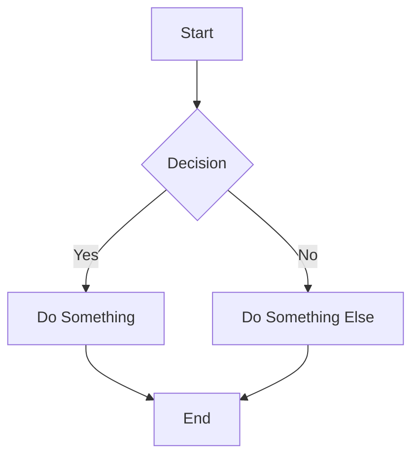
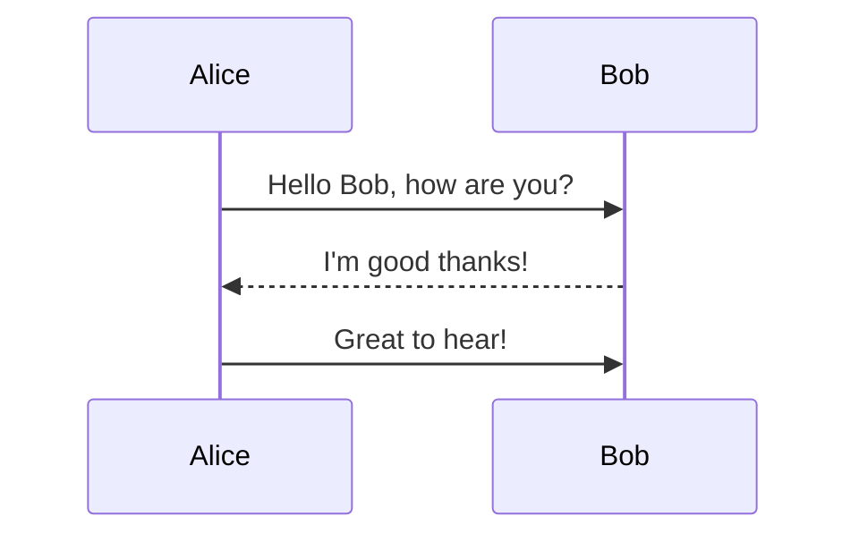
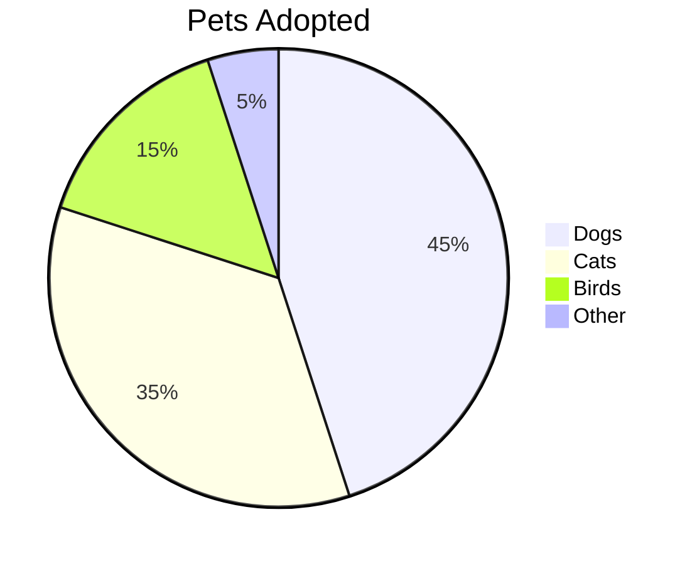
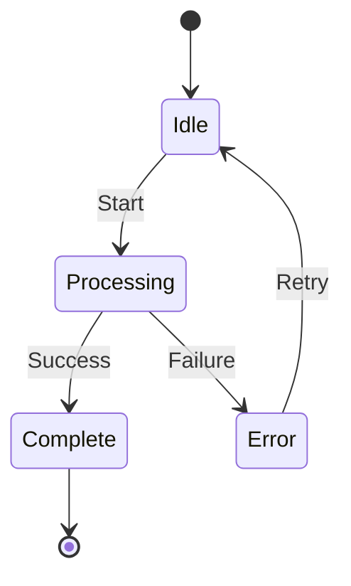

# Mermaid Diagram Test

This file tests Mermaid diagram rendering in Quick Look.

## Flowchart



## Sequence Diagram



## Pie Chart



## Regular Markdown Content

This is regular markdown content that should render normally:

- Item 1
- Item 2
- Item 3

### Code Block (non-Mermaid)

```javascript
function hello() {
    console.log("Hello World");
}
```

## State Diagram


